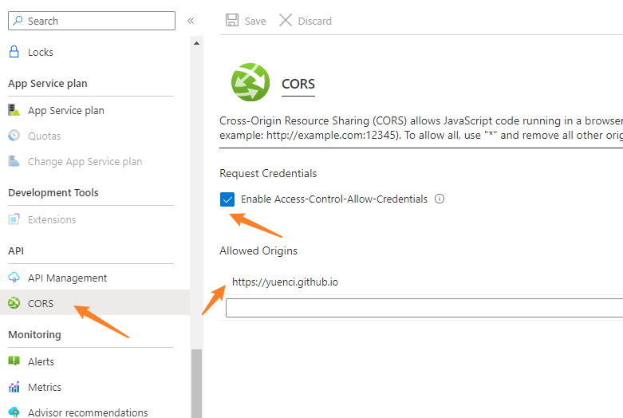

# Azure-Functions-Request

### GET Request

```python
# get
import logging

import azure.functions as func


def main(req: func.HttpRequest) -> func.HttpResponse:
    logging.info('Python HTTP trigger function processed a request.')

    name = req.params.get('name')
    if not name:
        try:
            req_body = req.get_json()
        except ValueError:
            pass
        else:
            name = req_body.get('name')

    if name:
        return func.HttpResponse(f"Hello, {name}. This HTTP triggered function executed successfully.")
    else:
        return func.HttpResponse(
            "This HTTP triggered function executed successfully. Pass a name in the query string or in the request body for a personalized response.",
            status_code=200
        )
```

### POST Request

```python
# post
import logging

import azure.functions as func
import json


def main(req: func.HttpRequest) -> func.HttpResponse:
    logging.info('Python HTTP trigger function processed a request.')

    req_body_bytes = req.get_body()
    req_body = req_body_bytes.decode("utf-8")

    logging.info(f"Request: {req_body}")

    content = json.loads(req_body)

    first_name = content["first_name"]
    last_name = content["last_name"]

    return func.HttpResponse(
        f"Hello, {first_name} {last_name}. This HTTP triggered function executed successfully.",
        status_code=200
    )
```

# Azure-Functions-CORS

### Local

```json
// function.json

{
  "scriptFile": "__init__.py",
  "bindings": [
    {
      "authLevel": "anonymous",
      "type": "httpTrigger",
      "direction": "in",
      "name": "req",
      "methods": [
        "get",
        "post" // make sure post method is allowed
      ]
    },
    {
      "type": "http",
      "direction": "out",
      "name": "$return"
    }
  ]
}
```

```json
// local.settings.json
{
  "IsEncrypted": false,
  "Values": {
    "AzureWebJobsStorage": "",
    "FUNCTIONS_WORKER_RUNTIME": "python"
  },
// Add the following snippet
  "Host": {
    "LocalHttpPort": 7071,
    "CORS": "*"
  }
}
```

### Deployment

1. Go to [Function Apps](https://portal.azure.com/#view/HubsExtension/BrowseResource/resourceType/Microsoft.Web%2Fsites/kind/functionapp) page
2. Set the CORS of APP
   1. Enable CORS
   2. Add allowed Origins




## Send Request

```python
import logging

import azure.functions as func
import requests


def main(req: func.HttpRequest) -> func.HttpResponse:
    url = "http://example.com"

    response = requests.get(url).text

    logging.info(
        'Python HTTP trigger function processed a request,response: %s', response)

    return func.HttpResponse(
        f"Hello, this message from Azure : {response}",
        status_code=200
    )

```

```python
# requirements.txt
azure-functions
requests
```
